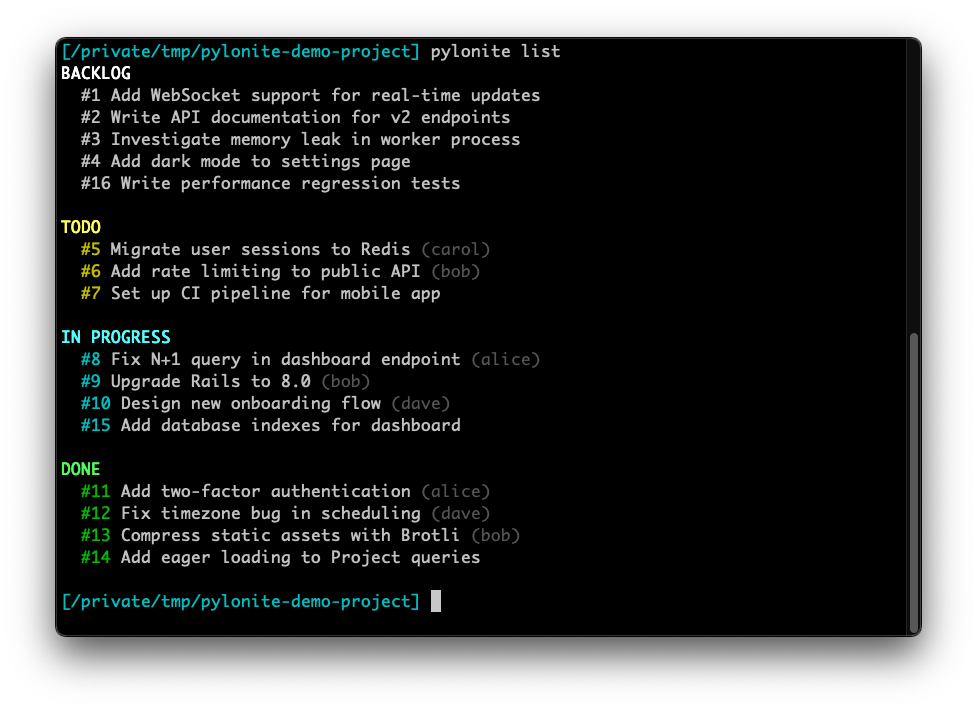
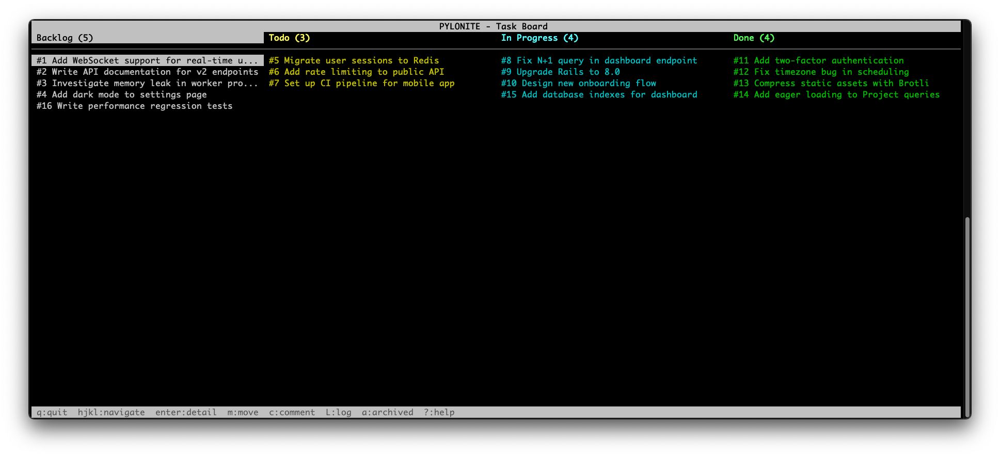
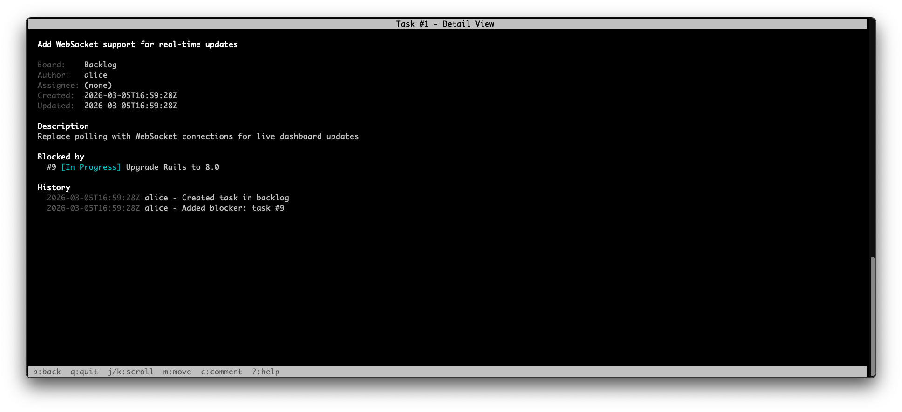
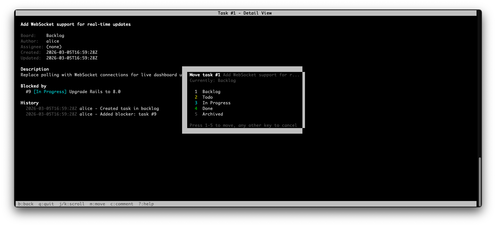
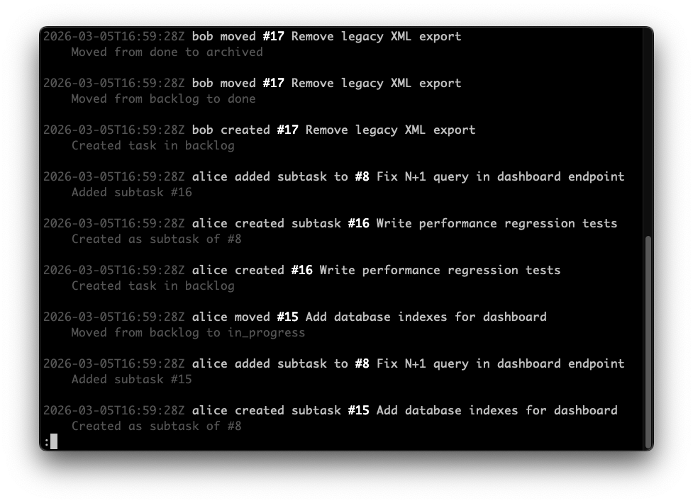

# Pylonite

A SQLite-backed kanban board built for AI agents and humans. Manage tasks, track progress, and collaborate through a simple CLI or an interactive TUI -- no login, no server, no setup.

Each project directory gets its own database stored at `~/.pylonite/dbs/`. The current `$USER` is automatically recorded as author for all actions.

### Board overview



### Interactive TUI



### Task detail



### Task detail with move overlay



### Activity log



## Install

```sh
gem install pylonite
```

Requires Ruby >= 3.1.

## Quick Start

```sh
cd ~/my-project

# Add some tasks
pylonite add "Fix compiler bug when adding ints and floats"
pylonite add "Write integration tests" --assign alice -d "Cover all edge cases"
pylonite add "Deploy v2" --board todo

# Work on a task
pylonite move 1 in_progress
pylonite comment 1 "Investigating type mismatch in binary ops"
pylonite assign 1 bob

# Check the board
pylonite list

# Open the interactive TUI
pylonite tui
```

## Commands

### Task Creation & Editing

```sh
pylonite add "task title"                          # Add to backlog
pylonite add "task" --board todo --assign alice     # With options
pylonite add "task" -d "description here"           # With description

pylonite edit 3 --title "New title"                # Update title
pylonite edit 3 -d "Updated description"           # Update description

pylonite subtask 1 "Write unit tests"              # Create a subtask
```

### Viewing Tasks

```sh
pylonite show 1                  # Full task detail (comments, history, blockers, subtasks)
pylonite list                    # All non-archived tasks, grouped by board
pylonite list --board in_progress  # Filter by board
pylonite list --all              # Include archived tasks
pylonite search "compiler"       # Search by title or description
```

### Workflow

```sh
pylonite move 1 in_progress   # Move between boards
pylonite move 1 done
pylonite archive 5            # Shortcut for move to archived
pylonite assign 1 alice       # Assign a task
```

### Comments

```sh
pylonite comment 1 "Blocked on API changes"
```

### Dependencies

```sh
pylonite block 3 1       # Task 1 blocks task 3
pylonite unblock 3 1     # Remove the blocker
pylonite subtask 1 "Fix int+float case"   # Subtasks are also tracked as dependencies
```

### TUI

```sh
pylonite tui
```

An interactive terminal UI showing all boards as columns. Navigate with:

| Key | Action |
|-----|--------|
| `h` `j` `k` `l` / arrows | Navigate between columns and tasks |
| `Enter` | View task detail |
| `b` | Back to board view |
| `m` | Move task to another board |
| `c` | Add a comment |
| `L` | View activity log |
| `a` | Toggle archived column |
| `?` | Show help overlay |
| `q` | Quit |

### Other

```sh
pylonite help                                    # Show full help
pylonite internal appropriate OLD_DB_PATH        # Re-map a database after renaming a project directory
```

## Boards

| Board | Description |
|-------|-------------|
| `backlog` | Default for new tasks |
| `todo` | Ready to work on |
| `in_progress` | Currently being worked on |
| `done` | Completed |
| `archived` | Hidden from default list view |

## How It Works

- Each project directory maps to a SQLite database at `~/.pylonite/dbs/<dirname>_<hash>.sqlite3`
- The hash is derived from the full path, so identically-named projects in different locations get separate databases
- Every action (create, move, assign, comment) is recorded in a task history with actor and timestamp
- Tasks support blockers (task A blocks task B) and subtasks (hierarchical breakdown)
- No authentication -- designed for local use where everyone has full access

## For AI Agents

Pylonite is designed to be used by AI agents as a lightweight task tracker. Key points:

- All commands are simple, single-line invocations with predictable output
- `pylonite search "query"` helps recover task IDs after losing context
- `pylonite show ID` gives complete task state including full history
- `pylonite help` provides a complete API reference with examples
- Task IDs are stable integers that auto-increment per project

## Running Tests

```sh
bundle install
rake test
```

## License

MIT
